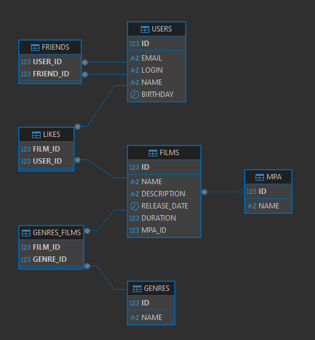

# java-filmorate
Template repository for Filmorate project.
# Диаграмма

# Примеры запросов
___
## Операции над фильмами
___
### Получение данных по всем фильмам
```sql
SELECT *
FROM films
```
---
### Получение данных фильма по id
```sql
SELECT *
FROM films
WHERE id = 1
```
---
### Получение списка лайков фильма по id
```sql
SELECT *
FROM likes
WHERE film_id = 1
```
---
### Получение списка жанров фильма по id
```sql
SELECT *
FROM genres_films
WHERE film_id = 1
```
---
### ТОП-10 по лайкам
```sql
SELECT films.*
FROM (SELECT film_id
      FROM likes
      GROUP BY film_id
      ORDER BY COUNT(user_id) DESC
      LIMIT ?) top
JOIN films films ON top.film_id = films.id
```
---
## Операции над пользователями
___
### Получение данных по всем пользователям
```sql
SELECT *
FROM users
```
---
### Получение данных пользователя по id
```sql
SELECT *
FROM users
WHERE id = 1
```
---
### Получение списка друзей пользователя по id
```sql
SELECT users.*
FROM (SELECT friend_id
      FROM friends
      WHERE user_id = 1) user_friends
JOIN users ON user_friends.friend_id = users.id
```
---
### Получение списка общих друзей пользователей
```sql
SELECT f1.friend_id, f1.user_id
FROM friends f1, friends f2
WHERE f1.friend_id = f2.friend_id
AND f1.user_id = 1
AND f2.user_id = 2
```