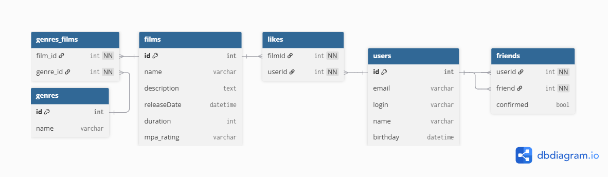

# java-filmorate
Template repository for Filmorate project.
# Схема

# Примеры запросов
___
## Операции над фильмами
___
### Получение данных по всем фильмам
```sql
SELECT id,
       name,
       description,
       release_date,
       duration,
       mpa_rating
FROM films
```
---
### Получение данных фильма по id
```sql
SELECT id,
       name,
       description,
       release_date,
       duration,
       mpa_rating
FROM films
WHERE id = 1
```
---
### Получение списка лайков фильма по id
```sql
SELECT user_id
FROM likes
WHERE film_id = 1
```
---
### Получение списка жанров фильма по id
```sql
SELECT name genre
FROM (SELECT genre_id
      FROM genres_films
      WHERE film_id = 1) film_genres
LEFT JOIN genres ON film_genres.genre_id = genres.id
```
---
### ТОП-10 по лайкам
```sql
SELECT film_id
FROM (SELECT film_id
      FROM likes
      GROUP BY film_id
      ORDER BY COUNT(user_id) DESC
      LIMIT 10) top
```
---
## Операции над пользователями
___
### Получение данных по всем пользователям
```sql
SELECT id,
       email,
       login,
       name,
       birthday
FROM users
```
---
### Получение данных пользователя по id
```sql
SELECT id,
       email,
       login,
       name,
       birthday
FROM users
WHERE id = 1
```
---
### Получение списка друзей пользователя по id
```sql
SELECT friend_id
FROM friends
WHERE user_id = 1
AND confirmed = TRUE
```
### Получение списка подписок пользователя по id
```sql
SELECT friend_id
FROM friends
WHERE user_id = 1
AND confirmed = FALSE
```
---
### Получение списка общих друзей пользователей
```sql
SELECT f1.friend_id common_id
FROM friends f1
JOIN friends f2 ON f1.friend_id = f2.friend_id
WHERE f1.user_id = 1
AND f2.user_id = 2
AND f1.confirmed = TRUE
AND f2.confirmed = TRUE
```